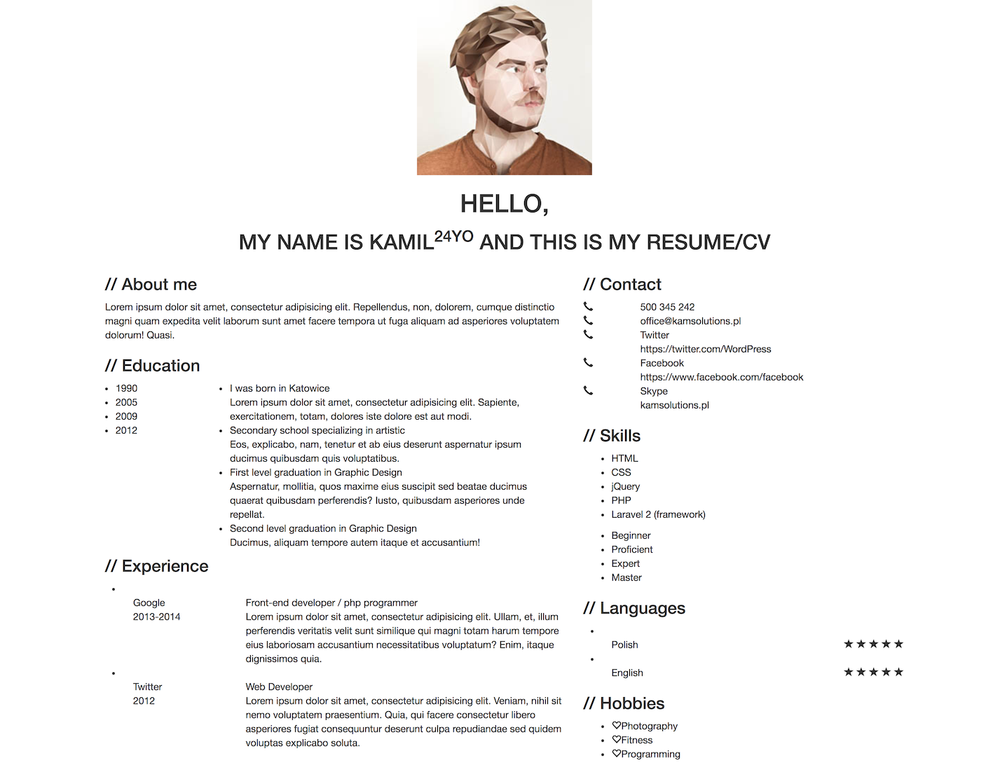

# Bootstrap layout online resume page
## Business Requirement:
Refer to this Prototype，Please write html in `index.html`, the result should display as below: 


* Only implement the content and layout, there is no need to complete the detail of style for the page modules.

## Practice Challenges:
* Understand and use the Bootstrap Grid system + CSS to the page layout.
* Apply the Bootstrap text component to display different fields.
* Nested using a variety of Bootstrap components constitute the page structure.
* Retrieve and use the appropriate Bootstrap component to complete the corresponding display.
* The page needs to have a responsive layout.
* Understand and simply apply the CSS box model principle.


## Practice Requirements:
* Use Bootstrap Grid for the layout.
* Adapt the mobile screen display.
* Complete the content in the page modules after laying out the overall page structure.
* CSS code should be stored in a separated file.
* Pass all the tests

## Practice Output:
Please push your practice repo to the site which the trainer will tell you.
The Repository should includes：
1. Implemented code
2. Screenshot after all code completed

## Environment
Chrome
NodeJs
NPM

## How to begin：
```
git clone `this repo site`
```
Stack Initial and build:

Open the index.html with browser, you will see the result of any change.


## Learning Resourse(Chinese Version):
1. [npm 下载安装](https://github.com/npm/npm)
2. [node 下载安装](https://github.com/creationix/nvm)
3. [jasmine用法](http://jasmine.github.io/2.4/introduction.html)
4. [git用法1](https://github.com/doggy8088/Learn-Git-in-30-days/blob/master/docs/02%20%E5%9C%A8%20Windows%20%E5%B9%B3%E5%8F%B0%E5%BF%85%E8%A3%9D%E7%9A%84%E4%B8%89%E5%A5%97%20Git%20%E5%B7%A5%E5%85%B7.markdown)
5. [git用法2](https://try.github.io/levels/1/challenges/1)
6. [git简易指南](http://gitref.org/zh/index.html)
7. [github用法](https://guides.github.com/activities/hello-world/)
9. [W3School](http://www.w3school.com.cn/)
1. [Bootstrap](http://www.bootcss.com/)

